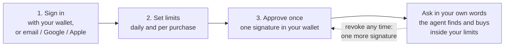
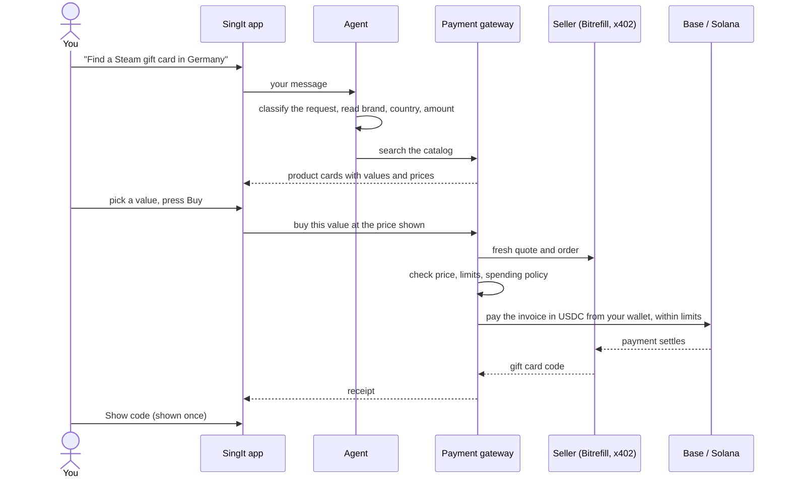
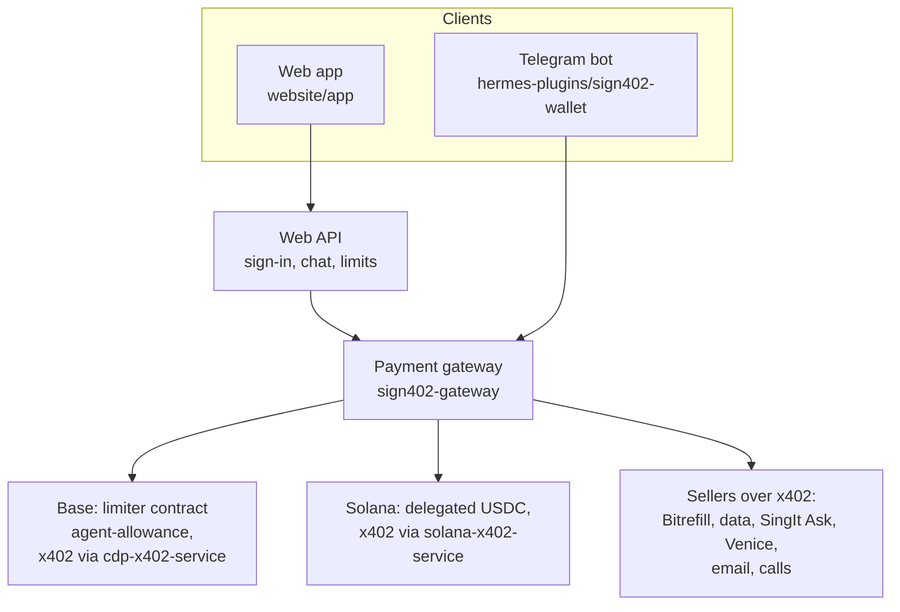

# SingIt

**Your agent spends. Your wallet keeps the money.**

SingIt is an AI agent that buys things for you — gift cards, eSIMs, mobile
top-ups, live data, paid AI answers — and pays for them in USDC over
[x402](https://www.x402.org/). You give it a budget instead of your wallet: two
limits and one approval. Your USDC stays in your own wallet on Base or Solana,
and the agent takes only what each purchase needs, inside those limits.

[Website](https://singitai.app) · [Open the app](https://app.singitai.app/app/) · [Telegram bot](https://t.me/SingIt0qk_bot) · [Documentation](docs/README.md)

[](https://github.com/bubon-ik/SingItAI/actions/workflows/security-gate.yml)

## How it works

Three steps, about a minute, then the agent just buys.



1. **Sign in.** Connect the wallet you already use — Rabby, MetaMask, Phantom,
   Solflare, or any mobile wallet through WalletConnect — or sign in with email,
   Google or Apple and get a wallet made for you. Signing in is a message
   signature: it moves nothing.
2. **Set your limits.** A daily limit and a per-purchase limit, typed in or
   simply asked for in the chat ("set a $20 daily limit, $5 per purchase").
3. **Approve once.** One approval from your wallet. From then on the agent buys
   inside the limits without asking the wallet again. Revoking is one more
   signature, in SingIt or without us (for example on revoke.cash).

How the limits are held depends on the network:

| | Base | Solana |
| --- | --- | --- |
| What you approve | A USDC allowance to your own limiter contract, deployed for you (we pay its gas) | The agent as delegate on your USDC account, for a total you choose |
| Who enforces the limits | The contract, on chain: daily limit, per-purchase limit and expiry are fixed in it | The chain caps the approved total; SingIt enforces the daily and per-purchase limits before every payment |
| Where the money is until a purchase | In your wallet; for micro-payments your agent keeps a small float (up to 0.20 USDC by default) | In your wallet |
| How a purchase is paid | The limiter moves USDC from your wallet to your agent as purchases need it; the agent pays the seller over x402 | The agent pays the seller over x402 straight from your account, as your delegate |

## What happens when you ask for something

The agent reads what you asked, finds it, shows it with its price, and buys when
you press **Buy** — or right away when you clearly asked it to buy. A gift card,
for example:



What the gateway checks before any money moves:

- **The price.** The order is priced again when you press Buy. The invoice must
  match that quote; on Solana it must also be no higher than the price you saw,
  or nothing is bought and the new price is shown to confirm.
- **Your limits.** The per-purchase limit, what is left of today's limit, the
  approval's remaining total and the expiry. A purchase that does not fit is
  refused with the reason, and nothing is paid.
- **The seller.** Each seller is bound to the address it is paid at and to a
  price ceiling. A payment request naming another address, asset or a higher
  amount is never signed.
- **The spending policy.** [Spending Memory](https://github.com/bubon-ik/spending-memory)
  can allow, escalate or block a purchase by budget and merchant history.

After paying, the gateway does not take the seller's word for it: a purchase
counts as paid when the transfer shows on chain, and as delivered when the
seller returns the goods. Gift card codes are shown to you once.

The language model never authorizes a payment. It only chats and extracts what
you asked for (search words, amount, country); the request is classified into a
fixed set of intents, the amounts are validated in code, and every purchase
goes through the same gateway checks. At most one purchase follows one message.

## What the agent can do

| Ask for | What happens | Price |
| --- | --- | --- |
| Gift cards, eSIMs, mobile top-ups | Searches thousands of brands on Bitrefill, shows the product and price, buys inside your limits, shows the code once | The card's price |
| Live answers: weather, exchange rates, flight status and prices, places to eat or stay, a web page | One small paid x402 request to a checked seller, counted against your limits | Capped per seller |
| Chat that bills by the answer (SingIt Ask) | Each answer is paid for what it actually cost | Up to 0.003 USDC |
| Private chat (Venice) | Switch models; credit is topped up from the same limits | Per top-up |
| An email to yourself, a phone call made for you by an AI assistant | Drafted by the agent; sent only when you press send on a card showing the recipient, text and price | $0.02 email, $0.54 call (Base) |

The app installs on a phone from the browser (Add to Home Screen) and sends
notifications when something needs you.

## Safety

- **Your money stays with you.** USDC stays in your own wallet. The agent takes
  only what a purchase needs, when it needs it.
- **Limits the agent cannot exceed.** On Base, the limiter contract enforces
  them even if our server or the agent were compromised; it holds no tokens and
  has no admin or upgrade path. On Solana, the chain caps the approved total.
- **One signature takes it back.** Revoke in SingIt or with any wallet tool.
  An emergency stop pauses a Base limiter for good.
- **A watcher reads the chain**, not our records: on Base, a spend to anyone
  but your own agent, or an unusual burst of spends, pauses the limiter and
  alerts you.
- **Nothing reaches people on its own.** Emails and calls wait for your press.
- **No double charges.** A payment whose answer was lost is never repeated
  automatically; it stays counted against your limits.
- **An operator kill switch** stops every paying action at once.

See the [security model](sign402-gateway/SECURITY.md) for trust boundaries.

## Telegram bot

The same agent runs in Telegram: open the [bot](https://t.me/SingIt0qk_bot) and
send `/start`. The bot uses managed wallets on Base and Solana (keys encrypted on
the server, so these wallets are custodial) and links to your web account with
`/link`.

| Command | Purpose |
| --- | --- |
| `/wallet [base\|solana]` | Choose a network, or show its wallet balance. |
| `/deposit [base\|solana]` | Show a deposit address. |
| `/balance [base\|solana]` | Check wallet balances. |
| `/limits` | View or change spending limits. |
| `/bitrefill` | Browse products and start a purchase. |
| `/purchases` | Browse saved receipts and reveal a code. |
| `/last_purchase` | Check the most recent purchase. |
| `/settings` | Delivery email, approvals and spending limits. |
| `/withdraw` | Send funds to your own address. |
| `/connect_imessage`, `/connect_whatsapp` | Pair an approval channel for purchases that need your yes. |
| `/llm_buy` | Buy LLM credits through Bankr. |

## Architecture



| Directory | Purpose |
| --- | --- |
| `sign402-gateway/` | Python gateway: accounts, the chat agent, limits, payment checks, orders and APIs. |
| `website/` | Landing page (`singitai.app`) and the web app in `website/app/` (`app.singitai.app`). |
| `agent-allowance/` | `AgentAllowance`, the per-user spending limiter contract on Base (Foundry). |
| `solana-x402-service/` | Solana USDC: delegated approvals, x402 payments, Bitrefill invoices, Venice and Exa. |
| `cdp-x402-service/` | Base: x402 payments and swaps through CDP. |
| `hermes-plugins/sign402-wallet/` | Telegram wallet commands and purchase flows. |
| `singit-ask/` | SingIt Ask, the x402 model endpoint that bills by the answer. |
| `singit-risk-check/` | x402 endpoint for payment-requirement risk analysis. |
| `docs/` | Design notes, operating instructions and verification records. |

## Development

Use **Python 3.12** and **Node.js 22** to match CI (`solana-x402-service` needs
Node.js 24). Clone the full repository: the gateway imports shared code from
sibling directories.

```bash
git clone https://github.com/bubon-ik/SingItAI.git
cd SingItAI
python3.12 -m venv sign402-gateway/.venv
sign402-gateway/.venv/bin/python -m pip install -e ./sign402-gateway python-telegram-bot==22.5
```

Run the tests:

```bash
(cd sign402-gateway && .venv/bin/python -m unittest discover -s tests)
(cd hermes-plugins/sign402-wallet && ../../sign402-gateway/.venv/bin/python -m unittest discover -s tests)
(cd cdp-x402-service && npm ci --ignore-scripts && npm test)
(cd solana-x402-service && npm ci --ignore-scripts && npm test)
node --test website/tests/*.test.mjs
```

The suites use test doubles for chains, sellers and wallets; no funded wallet is
needed. They cover limits, payment checks, retries, sign-in and the seller
integrations. CI also audits Python and Node dependencies.

Running the service needs wallet encryption and API secrets, seller credentials
and RPC endpoints: start with the [environment reference](sign402-gateway/.env.example)
and the [operations runbook](docs/operations.md). `main` is deployed by hand,
so the running version is whatever was last deployed.

## Further reading

- [Documentation index](docs/README.md)
- [Security model](sign402-gateway/SECURITY.md)
- [Deployment and operations](docs/operations.md) · [Recovery runbook](docs/recovery-runbook.md)
- [Decision API](docs/decide-public-endpoint.md) and [OpenAPI schema](sign402-gateway/docs/decide-openapi.json)
- [Dated verification results](docs/checks.md)

## License

[MIT](LICENSE).
