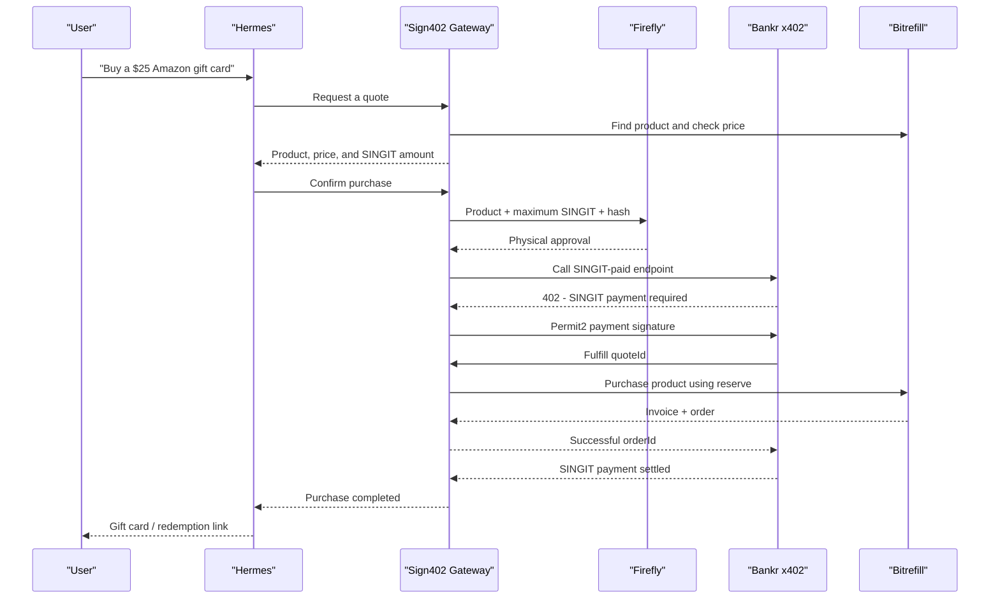

# SINGIT-Paid Bitrefill Commerce Design

**Date:** 2026-06-20  
**Status:** Approved for implementation planning  
**Project:** Hermes Sign402

## Summary

Hermes will let a user buy a real digital product from Bitrefill, such as a gift card, eSIM, mobile refill, or bill payment, while paying in the project's SINGIT token on Base.

Bitrefill does not accept SINGIT directly. The system therefore acts as a bounded commerce intermediary:

1. The user selects a Bitrefill product and receives a short-lived quote in SINGIT.
2. Firefly physically approves a commitment containing the exact product, quote, and maximum SINGIT amount.
3. Hermes pays a Bankr x402 Cloud endpoint in SINGIT.
4. The project fulfills the Bitrefill purchase from a prefunded reserve.
5. The user receives the Bitrefill order status and redemption material through the authenticated Sign402 Gateway.

The recommended MVP uses a prefunded Bitrefill account balance because balance purchases confirm automatically and are more likely to complete inside Bankr x402 Cloud's handler time limit. The reserve can be funded with USDC. A later phase may pay Bitrefill's returned `x402_payment_url` from a Base USDC treasury wallet.

## Goals

- Let Hermes buy a real Bitrefill digital product from Telegram.
- Make SINGIT the user-facing payment token.
- Require Firefly approval for the exact purchase commitment before SINGIT can be paid.
- Keep the Bitrefill API key, reserve credentials, and redemption data out of Hermes and Bankr logs.
- Prevent duplicate purchases when requests are retried.
- Preserve an auditable state transition for every quote, approval, payment, fulfillment, and delivery.
- Build on the project's existing Bankr custom-token, Firefly approval, Base, and paid-tool patterns.

## Non-Goals

- Physical goods or shipping fulfillment.
- A trustless atomic transaction spanning Base and Bitrefill; Bitrefill is an external commerce system.
- An unrestricted reseller marketplace in the first release.
- Automatic treasury rebalancing or SINGIT-to-USDC swaps in the MVP.
- Storing gift card codes or other redemption secrets in public dashboard events.

## Selected Architecture

The selected model is **SINGIT payment through Bankr plus project-funded Bitrefill fulfillment**.

Alternative models were rejected for the MVP:

- Requiring the user to swap SINGIT to USDC creates a worse user experience and makes SINGIT incidental.
- Nesting a Bitrefill USDC x402 payment inside the Bankr SINGIT x402 handler introduces a second live payment, more failure states, and greater timeout risk.
- Paying directly from Bitrefill account balance is faster and makes the first end-to-end purchase easier to reconcile.

## End-to-End Flow



## Components

### Bitrefill Client

A focused client module will own Bitrefill operations:

- search products;
- fetch product details and valid denominations;
- create a purchase using `buy-products`;
- poll `get-invoice-by-id` until the order is complete or terminal;
- extract order metadata and redemption information;
- normalize Bitrefill errors without exposing credentials.

Programmatic access will use a Bitrefill API key stored only in the local gateway environment. The client may speak to the eCommerce MCP server or use the corresponding official API endpoints, but its interface to the rest of Sign402 must remain transport-independent.

### Quote Service

The quote service will:

- validate the requested product, country, denomination, and recipient fields;
- fetch current Bitrefill product data;
- determine the Bitrefill reserve cost;
- obtain a SINGIT/USDC market quote from an approved Base liquidity source;
- add a configured volatility and operating margin;
- create a cryptographically random `quoteId`;
- set a short expiration, initially two minutes;
- persist the exact normalized product and price inputs.

The quote returned to Hermes contains human-readable product data, `singitAmount`, `maxSingitAtomic`, `quoteId`, and `expiresAt`. Hermes must not construct or alter any of those values.

### Firefly Purchase Commitment

Before invoking Bankr, the gateway will construct and hash a canonical purchase commitment:

```json
{
  "type": "singit-bitrefill-purchase",
  "quoteId": "quote_abc123",
  "productId": "amazon_com-usa",
  "packageValue": "25",
  "maxSingitAtomic": "2500000000000000000000",
  "recipientCommitment": "sha256:...",
  "expiresAt": "2026-06-20T15:02:00Z"
}
```

Sensitive recipient data is represented by a hash in the commitment and must not be shown in dashboard events. Firefly displays a compact summary such as:

```text
BUY AMAZON
$25 GIFT CARD
2500 SINGIT MAX
OK / CANCEL
```

The gateway proceeds only when Firefly approves the exact commitment hash.

### Bankr x402 Service

A new Bankr x402 Cloud service named `buy-bitrefill` will accept SINGIT on Base:

- network: Base;
- token: SINGIT contract `0xc2c1e0b7C401e6217193732272444D928646eba3`;
- transfer method: Permit2, selected by Bankr for non-EIP-3009 ERC-20 tokens;
- method: `POST`;
- payment scheme: `upto` for variable-priced quotes;
- input: a `quoteId` and an opaque fulfillment authorization created by the gateway;
- output: public order status and an opaque `orderId`, never a redemption code.

The configured `upto` maximum must be a deliberately bounded order cap, not an unlimited SINGIT allowance. The handler will settle the quote's actual atomic SINGIT amount with `X-402-Settle-Amount`. The exact behavior of `upto` settlement with SINGIT decimals must be verified against a deployed low-value endpoint before any real Bitrefill fulfillment is enabled.

The payer wallet and merchant `payTo` wallet must be different accounts in production. The first SINGIT payment may require a one-time Permit2 approval transaction. Subsequent x402 payments use signed Permit2 transfers.

### Fulfillment Service

The Bankr handler calls a protected gateway endpoint after Bankr has verified the payment authorization:

```http
POST /internal/fulfill-bitrefill
Authorization: Bearer <service-secret>
Content-Type: application/json

{"quoteId":"quote_abc123","fulfillmentToken":"..."}
```

The gateway validates the service secret, quote signature, expiration, Firefly approval, order state, product data, price, and reserve availability. It then performs exactly one Bitrefill purchase.

The internal endpoint is not exposed as an agent tool. Its credentials are stored as encrypted Bankr environment variables and local gateway secrets. The request must be idempotent by `quoteId`.

### Order Store

Real-money commerce state will use SQLite instead of the dashboard JSON event files. The store records:

- quotes and normalized product inputs;
- quote expiration and SINGIT price;
- Firefly approval hash and device result;
- Bankr payment intent and transaction hash when available;
- Bitrefill invoice and order identifiers;
- order state and retry counters;
- encrypted redemption data or a reference to an encrypted secret store;
- timestamps and terminal failure reason.

Dashboard events remain a redacted projection of this state.

## State Machine

```text
QUOTED
  -> FIREFLY_APPROVED
  -> SINGIT_AUTHORIZED
  -> FULFILLING
  -> BITREFILL_PURCHASED
  -> SINGIT_SETTLED
  -> DELIVERED
```

Terminal or recoverable branches:

- `QUOTE_EXPIRED`: no payment or fulfillment is allowed.
- `FIREFLY_REJECTED`: no Bankr call occurs.
- `FULFILLMENT_FAILED`: Bankr handler returns an error and payment is not settled.
- `DELIVERY_PENDING`: Bitrefill accepted payment but the order is still processing.
- `RECONCILIATION_REQUIRED`: Bitrefill fulfillment succeeded but Bankr settlement or the response path is uncertain.
- `REFUND_REQUIRED`: a settled SINGIT payment cannot be fulfilled or delivered.

Transitions are monotonic. A retry may read or advance existing state but must never move an order backward or create a second Bitrefill invoice for the same quote.

## Agent-Facing API

### Quote

```http
POST /agent/quote-bitrefill
```

Initial request shape:

```json
{
  "query": "Amazon",
  "country": "US",
  "value": "25"
}
```

### Buy

```http
POST /agent/buy-bitrefill
```

```json
{
  "quoteId": "quote_abc123"
}
```

This endpoint validates the quote, obtains Firefly approval, invokes the Bankr SINGIT endpoint through the existing Bankr CLI payment client, and returns the redacted result.

### Order Status and Redemption

```http
POST /agent/get-bitrefill-order
```

```json
{
  "orderId": "order_xyz"
}
```

The caller must prove access to the original authenticated Hermes session. Redemption information is returned only through this endpoint and must never be included in public dashboard events or Bankr handler logs.

## Pricing Rules

- Bankr's configured `price` is denominated in SINGIT, not USD.
- A quote freezes `maxSingitAtomic` only until `expiresAt`.
- The quote includes reserve cost, expected Bankr fee, expected slippage or volatility buffer, and configured project margin.
- The MVP rejects a quote when SINGIT liquidity is unavailable, stale, or too shallow for the requested amount.
- The gateway enforces both the quote amount and the Firefly-approved SINGIT policy budget.
- The project never silently raises the amount after Firefly approval. A changed price requires a new quote and a new approval.

## Failure Handling and Reconciliation

Bankr settles payment only for successful handler responses, so a Bitrefill rejection should result in a non-success handler response and no SINGIT settlement. However, Base settlement and an external Bitrefill purchase cannot be made fully atomic.

Required safeguards:

- use `quoteId` as the idempotency key everywhere;
- persist the Bitrefill invoice identifier before returning success;
- on retry, retrieve the existing invoice instead of creating another one;
- return an explicit error when quote state is ambiguous;
- poll pending Bitrefill invoices outside the Bankr handler when necessary;
- run a reconciliation job for uncertain Bankr or Bitrefill outcomes;
- maintain a manual refund path for exceptional settled-but-undelivered orders;
- cap individual and daily reserve exposure during the MVP.

If the Bitrefill purchase succeeds but the Bankr invocation times out, the gateway retains the order and fulfillment record. A retry returns the existing order. It does not repurchase.

## Security and Privacy

- Keep `BITREFILL_API_KEY`, Bankr API credentials, fulfillment secret, wallet secrets, and reserve credentials out of git.
- Use separate buyer, merchant revenue, and reserve accounts.
- Bind product, amount, recipient commitment, quote ID, and expiration into the Firefly-approved hash.
- Reject expired quotes and replayed payment intents.
- Never accept product details supplied by the Bankr request without matching them to the stored quote.
- Do not log recipient information, gift card codes, eSIM activation data, or API secrets.
- Encrypt redemption material at rest and redact it from dashboard events.
- Use authenticated HTTPS for the internal fulfillment callback.
- Keep the Bankr `upto` cap and Sign402 policy budget low during rollout.

## Testing Strategy

### Unit Tests

- product and denomination normalization;
- SINGIT pricing and atomic-unit conversion;
- quote expiration and signature verification;
- canonical purchase commitment and hash stability;
- policy limit enforcement;
- legal and illegal state transitions;
- idempotent fulfillment;
- redemption redaction.

### Integration Tests

- mocked Bitrefill product search and purchase;
- Bankr handler calling the protected fulfillment endpoint;
- Firefly approve, reject, timeout, and hash mismatch;
- Bitrefill rejection causing a non-success handler response;
- duplicate Bankr retries returning one Bitrefill invoice;
- pending order polling and eventual delivery;
- reconciliation of uncertain settlement states.

### Live Tests

1. Deploy a low-cost SINGIT endpoint that returns a harmless result and verify Permit2 approval plus custom-token settlement.
2. Verify `upto` and `X-402-Settle-Amount` use SINGIT atomic units as expected.
3. Exercise the full flow with a Bitrefill test product or the lowest-risk available product.
4. Enable a low-value real purchase only after the first three checks pass.

## MVP Scope

The first implementation supports:

- one country;
- one Bitrefill product or test product;
- one fixed denomination;
- one buyer wallet and one distinct merchant wallet;
- one SINGIT policy with a low per-order and total budget;
- a prefunded Bitrefill balance;
- quote, Firefly approval, SINGIT payment, fulfillment, status, and redemption delivery;
- manual reconciliation for exceptional failures.

The full catalog, multi-item carts, eSIM activation flows, bill-payment prepayment forms, gifts, webhooks, automated refunds, and automated treasury rebalancing follow after the fixed-denomination flow is proven.

## Implementation Boundaries

The feature should be split into focused modules rather than extending the existing large gateway server with commerce logic inline:

- `sign402_gateway/bitrefill.py`: Bitrefill transport client and response normalization;
- `sign402_gateway/commerce.py`: quotes, commitments, state transitions, and fulfillment orchestration;
- `sign402_gateway/commerce_store.py`: SQLite persistence and idempotency;
- `singit-bitrefill/`: Bankr x402 Cloud handler, manifest, schema, and tests;
- thin HTTP handlers in `server.py` that validate requests and call the commerce services.

## External References

- Bitrefill eCommerce MCP: <https://docs.bitrefill.com/docs/ecommerce-mcp>
- Bankr x402 Cloud custom tokens: <https://docs.bankr.bot/x402-cloud/custom-tokens>
- Bankr x402 Cloud configuration: <https://docs.bankr.bot/x402-cloud/config-file>
- Bankr x402 Cloud security: <https://docs.bankr.bot/x402-cloud/security>

## Acceptance Criteria

The MVP is complete when a user can issue a Telegram purchase command, receive a fresh SINGIT quote, approve the exact purchase on Firefly, pay the Bankr endpoint in SINGIT, cause exactly one Bitrefill purchase from the project reserve, and retrieve the resulting redemption material without exposing secrets to Hermes prompts, Bankr logs, or the public dashboard.
