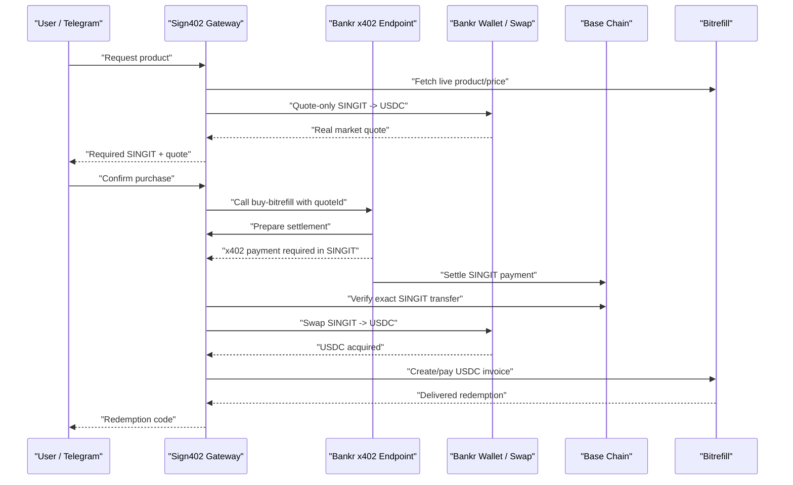

# Bankr Real-Rate SINGIT → USDC Bitrefill Flow Design

Date: 2026-06-26

## Goal

Let users buy real Bitrefill products with SINGIT at the real market rate.

The user should pay SINGIT. The system should convert enough SINGIT into USDC through Bankr, pay the Bitrefill invoice in USDC, and deliver the Bitrefill redemption code.

This replaces the current test economics where SINGIT is only used as an x402 authorization signal and the Bitrefill invoice is paid separately from a USDC treasury.

## Current Problem

The current `buy-bitrefill` endpoint works technically, but the economics are wrong for production:

1. Bankr x402 charges SINGIT for calling the endpoint.
2. Gateway verifies the SINGIT settlement.
3. Gateway pays Bitrefill with USDC from treasury.

That proves SINGIT payment happened, but it does not guarantee the paid SINGIT is the funding source for the USDC Bitrefill payment.

For the product, SINGIT must be the actual economic source of the purchase.

## Target User Experience

1. User asks Telegram/Hermes to buy a Bitrefill item.
2. Gateway gets the live Bitrefill price.
3. Gateway gets Bankr swap quotes to calculate the real SINGIT amount required to obtain the necessary USDC.
4. Gateway shows the user:
   - product
   - Bitrefill price in USD/USDC
   - required SINGIT amount
   - slippage/buffer
   - quote expiration
5. User physically approves with Firefly.
6. Gateway calls the Bankr x402 endpoint.
7. Bankr x402 collects the required SINGIT amount.
8. Gateway verifies the exact SINGIT settlement on Base.
9. Gateway swaps SINGIT to USDC via `bankr wallet swap`.
10. Gateway pays the Bitrefill USDC invoice via `bankr wallet transfer`.
11. Gateway waits for Bitrefill delivery and returns the redemption code.

## Architecture



## Components

### 1. Real-Rate Quote Engine

Add a quote mode that prices SINGIT from Bankr swap quotes, not from `SIGN402_SINGIT_USD_PRICE`.

The engine receives:

- Bitrefill USD price
- target USDC amount
- SINGIT token address
- maximum quote age
- slippage buffer

It returns:

- required SINGIT
- required SINGIT atomic amount
- expected USDC output
- minimum USDC output
- Bankr quote metadata
- quote expiration

Bankr CLI currently supports:

```bash
bankr wallet swap \
  --from <SINGIT_TOKEN_ADDRESS> \
  --to USDC \
  --amount <SINGIT_AMOUNT> \
  --chain base \
  --quote-only
```

This returns the USDC output for a given SINGIT input. To calculate how much SINGIT is needed for a target USDC amount, gateway will use bounded search over quote-only calls.

Initial MVP search:

1. Start from a small SINGIT amount.
2. Double until expected USDC output is greater than or equal to target USDC plus buffer.
3. Binary search to tighten the required amount.
4. Round up to token decimals.
5. Fail if no route or if required SINGIT exceeds configured maximum.

### 2. Bankr x402 Endpoint

Keep the existing Bankr endpoint:

```text
https://x402.bankr.bot/.../buy-bitrefill
```

But change its meaning from “authorization gate” to “real-rate SINGIT collection step.”

The endpoint still calls:

```text
POST /internal/prepare-bitrefill-settlement
```

The gateway response must include:

```json
{
  "ok": true,
  "quoteId": "...",
  "status": "ready_for_singit_settlement",
  "settleAmountAtomic": "...",
  "maxSingitAtomic": "...",
  "pricingMode": "bankr_real_rate"
}
```

The endpoint returns:

```text
X-402-Settle-Amount: <requiredSingitAtomic>
```

This makes the x402 payment amount dynamic per quote.

### 3. SINGIT Settlement Verification

Keep the strict verifier already implemented:

- token must be SINGIT
- sender must be expected Bankr wallet / payer
- recipient must be Bankr x402 payTo
- amount must equal the quote requirement
- tx must be on Base
- tx must be successful

If Bankr CLI returns no transaction hash, gateway discovers the transfer from Base logs using:

- start block
- payer address
- Bankr payTo address
- SINGIT token
- exact amount

### 4. SINGIT → USDC Swap

After settlement verification, gateway calls:

```bash
bankr wallet swap \
  --from <SINGIT_TOKEN_ADDRESS> \
  --to USDC \
  --amount <requiredSingit> \
  --chain base
```

The swap result must be parsed and stored. Gateway must verify that the resulting USDC is enough to pay the Bitrefill invoice.

If the swap fails or returns too little USDC:

- do not create a new Bitrefill invoice if possible
- mark order as `RECONCILIATION_REQUIRED`
- store swap error and settlement proof
- do not retry automatically without idempotency guard

### 5. Bitrefill Fulfillment

After successful swap, gateway uses the existing live Bitrefill USDC flow:

1. Create Bitrefill invoice with `payment_method=usdc_base`.
2. Transfer USDC to invoice address through Bankr wallet transfer.
3. Poll invoice/order until redemption is usable.
4. Store invoice ID, order ID, USDC transaction, redemption state.

The current checkpoint and refresh logic remains required to avoid duplicate Bitrefill purchases.

## Critical Unknown To Verify

The design assumes the SINGIT collected through Bankr x402 is available to the Bankr wallet that runs:

```bash
bankr wallet swap --from SINGIT --to USDC
```

This must be verified before live use.

Required verification:

1. Check Bankr wallet SINGIT balance.
2. Perform a tiny custom-token x402 payment.
3. Check whether the wallet balance increases by the settled amount or whether it only appears as Bankr x402 revenue/internal accounting.
4. If the wallet balance does not increase, the real-rate swap cannot be funded directly from the x402 endpoint settlement.

If this assumption fails, fallback options are:

- use a direct Bankr wallet transfer into the merchant wallet instead of x402 for Bitrefill commerce;
- use a Bankr payout/withdraw mechanism if available;
- use a dedicated receiver contract later.

## Pricing Rules

Use strict real-rate pricing.

No manual fixed SINGIT/USD price for live Bitrefill purchases.

Each quote must include:

- target Bitrefill price in USDC
- SINGIT amount required by Bankr quote
- slippage or buffer
- expiration time
- maximum accepted SINGIT amount

Reject quote creation if:

- Bankr swap route is unavailable
- required SINGIT exceeds `SIGN402_MAX_SINGIT_PER_BITREFILL_ORDER`
- expected USDC output is below target
- quote-only command fails

## Safety Rules

- Never buy Bitrefill before SINGIT settlement is verified.
- Never buy Bitrefill before SINGIT → USDC swap succeeds.
- Never repeat a Bitrefill invoice payment automatically after an ambiguous failure.
- Store all external identifiers:
  - quote ID
  - Bankr x402 result
  - SINGIT tx
  - swap tx
  - Bitrefill invoice ID
  - USDC transfer tx
  - Bitrefill order ID
- Do not reveal redemption unless recipient check passes.
- Live purchase still requires explicit user confirmation.

## Configuration

New environment variables:

```text
SIGN402_BITREFILL_PRICING_MODE=bankr_real_rate
SIGN402_BANKR_SWAP_FROM_TOKEN=0xc2c1e0b7C401e6217193732272444D928646eba3
SIGN402_BANKR_SWAP_TO_TOKEN=USDC
SIGN402_BANKR_SWAP_CHAIN=base
SIGN402_BITREFILL_USDC_BUFFER_BPS=1000
SIGN402_MAX_SINGIT_PER_BITREFILL_ORDER=<operator-defined>
SIGN402_BANKR_X402_REVENUE_SETTLEMENT_MODE=wallet_balance_required
```

Existing variables still used:

```text
BITREFILL_API_KEY
SIGN402_BITREFILL_MODE=live
SIGN402_BITREFILL_PAYMENT_METHOD=usdc_base
SIGN402_BANKR_WALLET_ADDRESS
SIGN402_BANKR_BITREFILL_URL
SIGN402_BANKR_FULFILLMENT_SECRET
SIGN402_TREASURY_REFUND_ADDRESS
```

## Testing Plan

### Unit Tests

- Bankr swap quote parser handles normal output.
- Bankr swap quote parser rejects missing output.
- Quote engine calculates required SINGIT with bounded search.
- Quote engine rejects unavailable route.
- Quote engine rejects amounts above configured cap.
- `prepare-bitrefill-settlement` returns dynamic `settleAmountAtomic`.
- Fulfillment runner calls swap after SINGIT verification and before Bitrefill purchase.
- Swap failure marks `RECONCILIATION_REQUIRED`.
- Bitrefill purchase is not attempted when swap fails.

### No-Spend Integration Tests

- Quote-only SINGIT → USDC route can be fetched.
- Gateway can create a real-rate quote without spending funds.
- Bankr x402 endpoint returns dynamic settlement amount.

### Live Tests

Live tests require explicit confirmation with:

- product
- quoted SINGIT amount
- target USDC amount
- maximum SINGIT cap

Do not run live purchase automatically.

## Success Criteria

The feature is successful when:

1. A Bitrefill quote is priced from Bankr's real SINGIT → USDC route.
2. The user pays the dynamic SINGIT amount through the Bankr x402 endpoint.
3. Gateway verifies the exact SINGIT settlement.
4. Gateway swaps SINGIT to enough USDC.
5. Gateway pays Bitrefill with USDC.
6. Gateway returns a delivered redemption code.
7. No separate treasury subsidy is required except temporary gas/rounding/buffer handling.

## Out of Scope For This Iteration

- Custom smart contract receiver.
- Automatic DEX routing outside Bankr.
- Automatic refunds.
- Multi-user wallet custody.
- Long-term accounting dashboard.
- Price guarantees beyond quote expiration.

